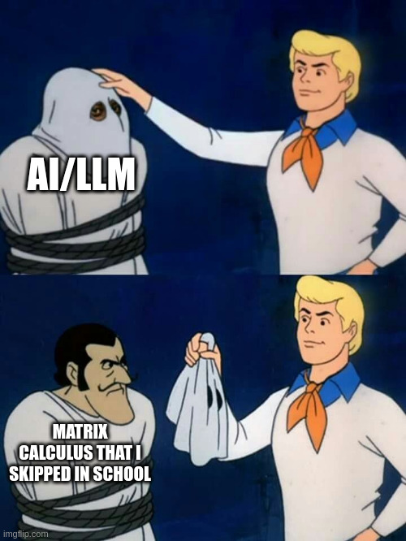

# Data Representations: Vectors & Tensors
- # Tensor
- **What is a Tensor?**
    
  At its core, a tensor is a multidimensional array of numerical values. The "rank" of a tensor refers to the number of dimensions it possesses.
- # **Tensor Ranks Explained**
- ![The Shape of Tensor. Tensors are the ...](data:image/png;base64,iVBORw0KGgoAAAANSUhEUgAAATQAAACkCAMAAAAuTiJaAAAA8FBMVEX////P4vPBwcHX5/bN4vXO4vP8/PwAAADQ4fTR5PXQ5Pe2uryktMP//v/T5fmZpq+jrLTp6+uywMve6/icqbW7vL7ExMXR4e6ntMSmtcHF0dyhrLbU4emqtsCcqbfZ5vZtd4Hf39+Ml6G4x9ass7iQkJDt7e3Nzc1aWlp7iZSwsLDY2NhERESDg4OlpaV5eXlfX18XFxeampovLy9PT0+Tk5N7e3tubm4oKCg6OjpcXFwqKioUFBTh8f9pc3uPnKeBiI1ncXaQnq5KVV5daHV3go7n9v3N2uBHS1ZgaW98i5u8x891g4g3P0eLlaRse4rNIGFLAAAZOElEQVR4nO2dC2OaStOAV1EQNSKCAhJQiYKXaIwxMTmtwZPW9m3TL/3//+abATSwYC7G9OJxPKeRYUV4mF12dnZWcpk+yOuk1iFpcpBXShpe7O8+ib9N0gdLe70coG0hB2hbyAHaFnKAtoUcoG0hB2hbyAHaFnKAtoUcoG0hB2hbyAHaFnKAtoUcoG0hB2hbyFugsf/VgbgDtC3kbdDEVpLs8PT+THlbm+aeJIj1fgZ4lGjcLDnCfXH1hhOJq4+wMMvGjwHfmHCAt0ErM3k+Jvr7QUs+Mhu/1idKb1RvOEqCvBEan6Ml9Z7QnEKCtG27n6SvkVqSum8PktSF1lHiUaoJp5EArX8BcmYT4lksNvcsSXf8G8Sys4srX/U7oLUZ2qxzPF9viRUml4tZfDuhOK/w92KBoQvnlHwjDfUmdpRco/wyaKMr1rZnM38jANA/C3aeXbJXw3XRXw6Nz9Dfl82fADQ+k8lSO0ptLJ6iT690Ihbos87kUplcmsh8NnZ4/qXQEIpzQezhzdQh1f74pobQ0h4rDoyMI87lI7QUJVtAY/GZS7XbrBj8Ba34CC32dQrvQUtlsvR5IDS6dAqhVWl1FqAxaWLy9DHgKC+F9k+12j8fkfEl63wkl+figCP9oXNue9A8cIPqTqHVuG53yqX9jl8Arzb1zRx0nTEJTL6dj1NASzvJ44UnQIudXYoHaLQWDCyrgKWVYgd5MbT+zXDMOdgLcyYAbQKU7OoFZ3uX4EGzSahN2wU0rPzpj/BPS8RD29DVq3UDaPb4fLaCVkgwnT8D2qhDyOUpIZ2bTv+cXI7QtKo3Hb+R4+DsueARsTtoeOzCORmcjy9mpD89vekitKH3lYM+7q5d/OHQsPG6mKBBOVwArXBFzr2C0xqpdolt+0V3BM3hptPTa4dMHPyuPtywc9EZ+7cJDlYbo8Gxfz60AScOr8czjvWqJ9ufkRaHp93i/uFEMAayU0vrtpyPOBFnNLuA7wJLP205HFfzoEF/Z7wy7T8Wmt85w5MFe2JRPBW78s9Fb3u3bdoM74ZIxsMWG0ATnal/l/Acx955/dnQCAlQ+W98aj6n4J8VwV22aZcXBKxtxNkI7UaEp2fQjHrQxD75k6Gt2EU3Vr2oKJAdQRtM8CbMBq1ut99p1YDP0EbdrLXaTQbDvwHai2Q30Nj103i9Ffzr/7/WH6A9SqQNWL0h66Yz1DAkdfFX0GLn8WdCY4/KTD42NsS8o+9ZUGjnMKvkPDcql1IoNxOh5bMx3zMP0Er0QTLZDEKDW7Kt7/ligS5CO0Em20N5TgrggVNGki0htHyGNjUfGjjslDoftzSAlsk0EFrmF1jaL48RtJl8KSp5vlSH6smDwVN7cJQjVrxUwurJ0Dp4eUND+dhBmN23ab9aJroQE3nREhdyXC9MyESI6WWhJ/ZjRU3Qp8m/CQcpLxJO4++CdpQ4JL3B4BOH9zcJu/EwCeqtoG3+ho3fsxvBAx9FXl5QJGgnjuhdqDqKfYBlj5KK+kIVT44bbANt1YF6Yv9+R0S3gkbGgxi02ji0/+YALSZOOIAQ4Aug+VvpYdLHfoU8+sWUcpeyFbTugIjd67FIWt3rK5YMbz5MENpgej1tkc4lNyDcbzM1lp3FEbGD0MZQpHe/VraCxhEyLuAI78caOZuMZoTlbIAGsPpdcnrWgvpbe+uJbS2X/dBGgG/SCela3bd+xTbQRIA24oYD0rr26qNYnXAiVk+nPxuTUweKDEdvPbFthT0nLfhycURasxkYWGs4c+xTOKnqeGgTJz2rEagOb6sIW0JjSWtyPWtdYHPRv5441wjtZtavgqVhVei8oy/1tMB5gN3DXbM5Z8C1WK464AbDM3tyOhidw70eOVhFfj00DEnNHGTHiWQyPE0TGy0NDXDS9S1tlhTN/yWCNfGsD41qZ+Y4Z8M0DgqzoDyHlmzqeEP5telvgIbGNDjvXtdI7Xx6yqbPx+NprTYj49Pp1Q2cGfGjfL9HMBA0mA665Ko7HHbSQIn1SOIZzQp9rAHO6Ru/YytoVbxffvDTxnEvnxBL7JWr4Iyf+vi7yugKTuHinxqB5xPppxHQMD25JDdwL89bI4RWnb3xO7br3J7aT9k3S6ZP7n9XGaAZjaDVZW/GV9B8dLtnF2ya6w+44ekVAXrQReo/e5SnZTto9tPQ2Lc+nt4iF7Y3EQROYDBAf27gsDhZhNhOi3gBNnLxVjdvO4f96e98xjV9Z6ld+dMZ/DMJ/vjin1Whk/zBl8vfNTT0AmFJ4Zk7Vn3zHd03aOzzQyxv90T3DdovkQO0LeQAbQs5QNtCDtC2kAO0LeQAbQs5QNtCDtC2kAO0LeQAbQs5QNtCDtC2kAO0LeQAbQs5QNtC9g1awvhiME0nPsEjMuM+LEdJ4/VHj3MK9w0aSU/Kul5+FL3cng4QwqRMi3HBkppAa9sLL4bgtGPp7JNBQHiPoB3hQhG1tsREZa5ZDkBbSBEB/by3YB0D3jYYRgpeoK4vMcJXK0sNlOAg8E6qN1fTBvYIGppT2sALP35ExkvG97LD2guaJSMtdMspS5Re+nprALTqiv2a3Pzkp7pCtVfQSM2Q8ApDIOaVXlF3WOuYoUTqyZWeEEOp/GuoZdKvzKPqhlRZFgGa36jtCzTvampwrQ3vFYCR5vc/taLsdGh7Amamenc3j+gboP+sFdV24WQeBg/mNjeWWlHbt+qJ0GpNA65M04q+aJpuyE18c9Eu67AVEu2HrsmfDD0qhtFUi0X10wJ2lMOlNbdn7CE0lEK83dINgGBCQ8fzfONRGKanFl2lQYvyHaEFlTb8IHDxVuwdNJYVR4Jphu1G1nUX7eNuuTRNWTbDwvS0h893JiUnje/AZnmry+sPyPBX1uuuZ7r7Bo3YQuxBKDVdXS0+CPNob0OaH3/6ai0qtPqLtTjuafJSislSEFT1OWjPhu1fGdd/99kwLBEtCStUBNqtCtAeVk/IxupPQ2m69U/3UqQwPAQswWV6ck+K7gBparr8PLTgTMLXup4JRPsX4J/QmRirVOCBnw9kD96dGmsDs0ibxUjHt5p6Z1iCFGUJDVdTc5t1iowkuS60crc9qq8BnRB4vOjm89BGHEg3PAOUJf2r4G3rgrtphffMHJpJB7vgZMB5+1ly+u6WJpb9jn0IAtiHprqCQO8AZqrRrEfNCaqgdVcsuvc/aGYSINZeBg29r+E4YiAeNFRwDqldk8c615p6p43zgXHGTgv03lxlO0g8Y/3Zpq8QNvYmtI9l43vsxTGjNJSINKHDpTVlCd6uHo2e1JuacVuXlEakPOO6qqo2BSyuHId21JHZy6Glb0hrfH1RJaPJ6ccRQpt4xtaHysCFQFz1yeD89OKf2ZRrkbOLMTeocTc2N+UcjnBpcjryFyh6BTNWnI1ns8voXGd7uALZH3ci06lAYxiaZkSkB8xUY1GBtxq8WYu21AxXgOJhpaeGvsay4vfzNHX9Wnp9jRdBm04mHbjgbgHr2OUNUuoP+6erkZRZh7TWDdUHEQqxaIDDkX1GyGRIpgPC1cjgIxG5Cdrr6avW1sSKPXCcs5uIPbXOVyd3I17+E/lAukN1UnWtYpjQovWa3laoJyIrgta7dXXsVITKVySEZlpKKpWF19rOUoywhqY+C2005JDKoH/2kXT81YauOTt4HMzCeTKY6YCTg89ZXABrcDY+H+KseNDiZY5wvTXSdV4DjYDlBgd2zs4cIqb7szQRrwnbseHbqy00XdtPoDhibXbyde63YkHrBH0KYWno6p07j7hJ4BodfzuRfyrhvklQHKCpt0Ylaq3G/b+WDAZYLCI0gPds9RxdI52+c76CNg0WGGJPzyImcA7Qbrw/l6MW59ijMLQLrJ1+asFroH0UW4PhDameDxzObnEjhxuIH8iHkT+JNj0dEXuVCMiOvtJtt+TeQa/27iHeqC+Fk6VCdzUk2X2QlsZnJRg0knxnAGE+yLK2gga929XvkiVDw4yF0yFeeZoLoEGbduFNJe8OvXWI1jUOMzEuvHSLy5FzwYrXVwQuCu2PI2dDFiyWXL8y763FdW+4jjeJfHDeaoEdX1XFDzdevhWLay12CVnNRr6Mj1+4D6pluLHOAzwIDf1zPdoFBjiapd0xy1sl2F77TpLlahFo+tOWdumduTi5/qfzgZ2MsPJByy9i1ofInUN/BFrjVY8NzLLVwYVuSDoN7d9ZbUKcaWsI/c2OPWNxJUTx4nXMyACezv0P0Dpc3HQAGjyeh1WRu/ISTbxvvXF8aDYLzEqREQlp7roaQFvGO1xLcMhPoh1gsDMDfPEH5n8RfwIHSqQFtGfCIzRV76zGzJOgrVYVYkNj6OvFbIIij+/ZG3/7KFKWrNfGwoyR10I7x+zlM9IF0+ZW0K7J1MtSm9bgHg6CpaLKx3itkTYKmGlqz5pTTtUcmGm9OvhOjTA36R5aM+N7jxrWheP0TKiQIUszO+v02yd9T2+Q6iiUGf/YloVatX6fWok4skwBVLJX5/wMMOHE5pzRxWjMpVtwV64KIjT+HCZ1ONzldOZnApKCG3jmazEt9K2NW930dqxe8F9TU+Vl0cTNkKBaheIrHz/QmvoPZKaaHjRDFwwBc11eHVjZtGxxUv5ztMBrUzFY2+sniy0yqNnQronQc7Ox1yyKqLdrGChp4UGrwUK2odVHKjL2uFyGj6xxC5sW9ClOvPdMaBfzHYcvLIaPrHCr8IygPkJTTdOdhK7iFdA2U6OgHHkrO4T2v9L3XDUFQeMQqurr7wqOWVVwxZtMJrsWviLjxT4wmVTmUaD7xQM0AdfDjQrTw0Gfh3wmlw0Vz2byQvERmuYu2mEGFLSNNpGkZ+O8Hnckql9I7cVSVWJrA/mW9sBH171VsowPjV5MKLA0PhtZq0hJ8WFLM75ZRrtduFrlmMeg2WKSQAVJkJZIktUs20rS7zwJdAUttApVAI2hV3LiLbUoV2JLiSVCy1HQNBk6xvPKYmOXo+Atj1+hpEoW97SuUrm3iBUrWqmcWKQW10Lxt6YMxqExWUr86lm0GKAQklSGtzQVLC1FlQ+qJw/V81FyUNyvnrKAHkGzzjBf9O/Gxs5tlceVrcNrfuMmrpOVsFRamZRpXYnn8zqpKQlr7vOFnUNr0GvN5QGahi17uHoiNAahncQtredbGkALWVoq51kafAL6at5AkmT2itrGuGfVX5stdIQVtCx9glkeoVHKXCrrQcvG185T/kJoJnSIj6HrJrjafxAavwU0qJ6m9s3VTH3hIsMDtBdA01RdaKJPKt2p2p5bWnEDtOJGaA8J0HAcTf3WLZumLpzcqcUnoSUs8JlKhpZKgpbKZHn590HjK0IyNK+fdhJbmn/lEUS1OYSGIn9BV3QpCE/HPf96aLKmar3la6CpUDwOzYNpYFirqcl7BS32WxUITetVDD5ePYuJ1fO7pj2UDUqP0FRgr8+DEN5eQcslVE/Dqsz1pDZN+5YIzRW+6AnQgL0GjoDyE6NR+w0tX9F7i/v7WJuWB0v71E5yo9xvWDwGTTZ+4CQ1qJsYWNkdtMSnZyqX5c1fBa0g8fnIGFC+VPlRTCmKzJRK3iCjN1yEg45za6mc3MM2v9J6IjVdRVGEPJPnH8vDRyVz6eLkrKY3ccsf7jb2A1qtXW63BSscvbOaqqkb/7p3d4LVvG0+yv8ZFf3bUrfc5m1Y/b+KoVV6Revuzg2rb6dWxahUFHn/oKGwFjXHpyF96VmGrgnWcUQU5fhrt24u6wqlZoTmfKHpTbq40li6FLSNDvtfBA2X1bKoYECJkZa6a6h3VkI4Sqj36nTARTIerPmi2IwovRje0pT3EJpnZxSDxpelCQ/QO4ua+cJIX5tF+fYrXV4yLPWBaTYT2JtqBJpb2wgt6ffjmCoREvQ4NESrFZ4vySTdKMVHhpgdQ8PEgcsYA+mHrhYtoxeb41eHDlezHiuvP6iapXyLTT1tLItq0YemmhjCc9drn9PQ2FY1HZeqSBLVNVJL0FerrFhI0g9i1/1GaPZlfNriwgQ/cSF8ofX3S63Y/BorbjxAL3ZhxYp7fY0ghKfp0GO2HtcGfUuMgGwOUb3uKFtLoWzKlPTQ0y4uNTm6x9Sbqmo+6HTxMqhVbWlQxWXTmy4UQENL64WqSQxaQk5QodAe4O81xNUj0k8oDuoWlKb3tNuvnNLxvFTjrUDFm7JiMfnonnzJKqp3J7E2RurhfKAHSp/PM3IArehDW3iY2ERocPPytJTgVfUaL2oHX9JJuUQXh/PTSVWJ6eFAu23ToElLKzkqJJevmMEoR0iyqVymBG4U+J7xEJ4HjcdfDAlH/BjBeISmLb4Na+lazU5+ELDxp6c3voYPgtjTMFsyAVpMm8qV4emJP3pCH2nn0KrHsee8Z2nqQykTDkcp3nC3JiS4UQgNnp7ZyHhazh9P86HB8XRJUiSpWXi3Lkfge8Z+9ORX+Z7+yG0pGxsaemIQcuNwt2l6TqeMzH7quxiEfBLab3PYdwvNs7TmMYM93Xd0o37veNrOoWma1sTpfktT2xdoGwMru4IGzwMvhLfUtQO0l0ErgqXdCrqugZ3tCNofMAiZFCPYJoQXfXr6w92Y/CibTYUpNSQP4b6M3L43tKWFdtYz9mq4exO03gZoG0J4DwnQcJjb8DL46suy8HS+5z5AU3++fC4HhvDc5QZovROGkSpLQ/8PQPtZN6LQUgG0Ck+fLkJ7EIzE6qkt7yVmDswMWX6mTaN/x9GTNLhRMaXi+Z70b0EqWV4ntVQm9rOPmXcIrPBZylmDp6f6sz7X/SmPwfyKLCApPXghPPypyzBP/nvxTv6i51LB9FG/PJSSDW1ZnzOS9h180+dyo5ItDXxPJeZLZj1otDKLPZFEN2r389MKSiY6TRQsTW/2DN1i4OZlM8Fe/NFTgPbJwjm3sBX6CNNzvxm6m1Mi0LIZXjA+W5pZtB7U9cjtU9DoyYWIAaunQmszJaieeUqJzi5OgIlMH/aL79hhR2jHSi4XGW/lK7d1aLvL3kAsz/OBFt4se1K9wvhzu0MDt98EMKdygymFimOIQPAGeSU/v+dpaCyp5lczHvOhV5XofDDw8/jKM2XSxl/WDCtLOZ7RSdobSOKjr10PdxMywHE6ywotB2G6GNArf7O+W9a3R62p6wtdF8q3bu9HJOJXXmDc6pPRfLA+C+FlJSxB0zVLNrUXQYutY4SSJosEbbtDLpNKL4gTW/cI5T2iUaQlRJJNoI8wV5puRcV4gOQvIyQ1Gn66HTRTbk+KZOHhjqU1X1QsLTzkjVkw8/pSl9fQNqcuvna4e5N64zD4hh1bCpzuILb0jVT/qbmG+vMkFCTxQy76g6B9lyLZURhM/6FbUs/S541wcVyRaakKq8CK5lta8iDkpinxiXPfRftVM+ih+K6hkVoCs6ZadCvNezq8JLUtVbilg1QYJdWs+Sc9FiUFZqoQxAjQ4LTmKpkwVj0LSZPZcUp80hx3i1hJpRcknXiUnU+JP6q1v0hBZuxK6pi97paNEBzf0DRw2ZcUsoYk9WRNcytJzOA4wioahQlUraNNCWXV2Jg/StWbEk/vwbhnLBDgPwiUWEQhn2/svE1zbo1ItjVsyBhG0pquUqdEh87DZ1pZr2PusHFrxfT3XjhqBQ3atB9Q3ZLTfOL9tFXnFjyC2O9tYz8tHlLIlLwuR6yblnuHLofk9xIi0SgNp0LWMYNk/To5uT/paaqpB2klfoIJvu576B9Z91jk3ssvOfH3WloEmtEM/axTgqUFva31L7v7/TSBiXXxU14/jVamPGjgESi0R/AOyRd4j7LhGIoPregyfDj7A96jG2XeM6Ha40f9e7g2wgPjKVd7sDh4Yx60ope6KDdb7BNZePvge24YhNwij8DE9XI0Y7GIJJQfoD2dfCEYOEJU8H5S+wDtZdBMARdFkQvRdNcDtGfingDNXFB9/gO0TdCCzGJDEyZ0zu++QdsyGkVNS/Chad6sIRfXaIg6MgdoT0LTdWsUd/0O0IJ07ERo2uJqlDCI8Z+B9lQWnkHPGlq1acYocRjnXaD9sonKG6EtXwVNW26AJvQTB8s25HsmBFZ42ovKpfLleGAF/K6873tm6R35d4BGfwdfMaEz+qNcinjKmMlvGQAtNpvOC+GdlfmMogReYCqIEeDstEXyeOGLLU3g4y44OJk6HX5dJclmMvQiD+8SWEmCpp+xBT68OAmGoHgLw5gleuYk813Vbu12qRR41is9b8JTgO6fPQHtUXKrVyntTYnPRV+MNyU+Fy2cU3CmfBoTPqgP5N4jhEdHb7IVGa6VFFJw+Tgl1F9gAtfcs4rWpLKuJKsX0zOaImnjcZTAyjAGlGEEbSOz+MjtxinxSXPcE6bEV6vVQvVILFTjHyjseEq8l/RAj/FV3AVhgUIuEg1L5RnL6tuVWIiM6TVbBIpnI3syWUbQN9TNJGjJJTcx36TecJRNZ7GtFMLxI08My1sTr8CslnXk8cUrWea2T8QKgxvrNBF4fzzFcbI2ozQajzWskWtIrmdnyaPzLwysJOvZo+Q1hchRIvydrzV0xCaIF9YZxCpAGtepi5s/rjDJHsWKgzzxvXuzdvevlAO0LQShvfsq0fsmB0vbQtLkMqGLcZCnpNb5fw5Gr1FIAJyMAAAAAElFTkSuQmCC){:height 172, :width 308}
- **Rank 0: Scalars**
	- A scalar is a single numerical value. It has no direction and no dimensions.
	- **Example:** Temperature (e.g., 25 degrees Celsius), mass (e.g., 70 kg), or a single pixel's intensity.
	- **In Programming:** A scalar is represented as a single variable.
- **Rank 1: Vectors**
	- A vector is a one-dimensional array of numbers. It represents magnitude and direction.
	- **Example:** Velocity (e.g., [10, 5, 0] representing movement in x, y, and z directions), force, or a list of stock prices.
	- **In Programming:** A vector is represented as a one-dimensional array or list.
- **Rank 2: Matrices**
	- A matrix is a two-dimensional array of numbers. It's used to represent linear transformations, relationships between data points, or systems of equations.
	- **Example:** Image data (grayscale), a spreadsheet, or a transformation matrix in computer graphics.
	- **In Programming:** A matrix is represented as a two-dimensional array or a list of lists.
- **Rank 3 and Beyond: Higher-Order Tensors**
	- Tensors with three or more dimensions are used to represent increasingly complex data structures.
	- **Example:**
		- **Rank 3:** A color image (width, height, color channels), video data (frames, width, height), or a volume of 3D space.
		- **Rank 4:** Video data with color channels (frames, width, height, color channels), or a batch of color images.
	- **In Programming:** Higher-order tensors are represented as nested lists or multidimensional arrays.
- # **Why Tensors Are Crucial in Machine Learning**
- **Data Representation:** Machine learning models process vast amounts of data, and tensors provide a natural way to represent this data.
- **Neural Networks:** Neural networks heavily rely on tensors for representing weights, biases, and activations.
- **Tensor Operations:** Libraries like TensorFlow and PyTorch provide efficient tools for performing operations on tensors, such as matrix multiplication, convolution, and pooling, which are essential for machine learning algorithms.
- # **Deep Learning:**
- Deep learning models, especially those dealing with images, videos, and natural language, utilize high-rank tensors to capture complex patterns and relationships.
- # **1. Tensor Shapes and Axes**
- **Shape:** The shape of a tensor describes the size of each dimension. For example, a 3x3 matrix has a shape of (3, 3). A color image with 100 pixels width, 100 pixels height, and 3 color channels will have a shape of (100, 100, 3).
- **Axes:** Each dimension of a tensor is referred to as an axis. Axes are indexed starting from 0. In a (100, 100, 3) tensor, axis 0 is the width, axis 1 is the height, and axis 2 is the color channel.
- # **2. Tensor Operations**
- **Element-wise Operations:** Operations like addition, subtraction, multiplication, and division are performed on corresponding elements of tensors.
- **Matrix Multiplication:** A fundamental operation in linear algebra and neural networks.
- **Tensor Transpose:** Swapping the axes of a tensor.
- **Tensor Reshaping:** Changing the shape of a tensor without altering its data.
- **Tensor Reduction:** Operations that reduce the dimensionality of a tensor, such as summing or averaging along an axis.
- # **3. Tensors and Coordinate Systems**
- Tensors can be used to describe physical quantities that are independent of the choice of coordinate system. This is particularly important in physics and engineering.
- The components of a tensor may change when the coordinate system is changed, but the tensor itself remains the same.
- # **4. Tensors in Different Fields**
- **Physics:** Tensors are used to describe stress, strain, electromagnetic fields, and other physical quantities.
- **Computer Graphics:** Tensors are used for image processing, 3D modeling, and rendering.
- **Data Analysis:** Tensors are used for representing and analyzing multidimensional data.