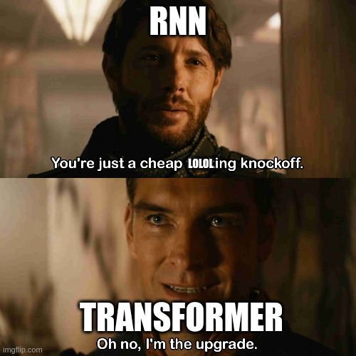

# Traditional ML
- **AI:** Machines doing "smart" things like humans (language, images, decisions).
- **Machine Learning (ML):** AI that learns from data, not just code.
- **Algorithm:** A set of steps to solve a problem.
- **Data:** Information used to train ML.
- **Model:** A learned pattern that makes predictions.
- ## **Training & Testing:**
- **Training:** Teaching the model with example data.
- **Test Data:** Checking how well the model works on new data.
- **Data Leakage:** Accidentally using test data in training (cheating!openai).
- ## **Learning Types:**
- **Supervised:** Learning from labeled examples (input & correct answer).
- **Unsupervised:** Finding patterns in unlabeled data.
- **Reinforcement:** Learning by trial and error with rewards.
- ## **Data & Features:**
- **Feature:** An input used by the model (e.g., age, income).
- **Feature Engineering:** Creating better features from raw data.
- **Feature Scaling:** Making features have similar ranges.
- **Dimensionality:** Number of features.
- **Target/Label:** The answer the model tries to predict.
- **Instance:** One example data point.
- ## **Model Issues:**
- **Complexity:** How "smart" the model is.
- **Bias:** Model makes simple assumptions, might miss patterns.
- **Variance:** Model is too sensitive to training data.
- **Bias-Variance Trade-off:** Balancing simplicity and sensitivity.
- **Noise:** Random errors in data.
- **Underfitting(stupid):** Model is too simple, misses patterns.
- **Overfitting( also stupid):** Model learns noise, not real patterns.
- ## **Training Process:**
- **Validation:** Checking model performance on a part of the training data.
- **Regularization:** Preventing overfitting.
- **Batch:** A small part of the training data.
- **Iteration:** One step of training on a batch.
- **Epoch:** One full pass through the training data.
- **Parameter:** A value the model learns.
- **Hyperparameter:** A setting you choose before training.
- ## **Optimization:**
- **Cost Function:** Measures how wrong the model is.
- **Gradient Descent:** Method to make the model less wrong.
- **Learning Rate:** How much the model changes with each step.
- ## **Evaluation:**
- **Evaluation:** Measuring model performance.
- ## ML and NL
- **Linear Regression:**
	- **What it does:** Predicts a continuous output (like house prices) based on input features (like size, location).
	- **How it works:** Finds the best-fitting line (or hyperplane in higher dimensions) that represents the relationship between inputs and outputs.
	- **Use Cases:** Simple predictions, trend analysis.
	- **Analogy:** Drawing a straight line through a scatter plot of data points.
- **Logistic Regression:**
	- **What it does:** Predicts a categorical output (like yes/no, spam/not spam).
	- **How it works:** Uses a sigmoid function to transform a linear equation into a probability, indicating the likelihood of a category.
	- **Use Cases:** Classification problems, such as spam detection, medical diagnosis.
	- **Analogy:** Drawing a curved line that separates data points into two groups.
- ## **Neural Network Algorithms (Deep Learning):**
- **RNNs (Recurrent Neural Networks):**
	- **What they do:** Process sequential data, like text or time series.
	- 
	- **How they work:** Have "memory" that allows them to remember past inputs, making them suitable for tasks where context matters.
	- **Use Cases:** Natural language processing (NLP), speech recognition, time series prediction.
	- **Analogy:** Reading a sentence word by word, remembering the previous words to understand the current one.
- **CNNs (Convolutional Neural Networks):**
	- **What they do:** Process image and video data.
	- **How they work:** Use convolutional layers to detect patterns and features in images, like edges, shapes, and textures.
	- **Use Cases:** Image classification, object detection, facial recognition.
	- **Analogy:** Scanning an image with a filter to find specific features.
- **GNNs (Graph Neural Networks):**
	- **What they do:** Process data that can be represented as graphs, like social networks or molecular structures.
	- **How they work:** Learn from the relationships between nodes in a graph, allowing them to capture complex dependencies.
	- **Use Cases:** Social network analysis, recommendation systems, drug discovery.
	- **Analogy:** Analyzing connections between people in a social network to find communities or predict relationships.
- **Key Differences:**
- **Traditional ML:** Works well with structured data and simpler problems. Often relies on hand-engineered features.
- **Neural Networks (Deep Learning):** Excel at complex tasks with unstructured data (images, text, audio). Automatically learn features from data. Require significant computational resources.
- ## **speedrun:**
- **Linear/Logistic Regression:** Simple predictions.
- **RNNs:** Sequences (text, time).
- **CNNs:** Images.
- **GNNs:** Networks (relationships).