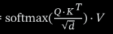

# Transformers to Vision Transformers
- What is a Transformer?
  A transformer is a type of neural network model driving the current AI boom.
- Introduced by Google in 2017 for language translation, it has since been adapted for various tasks (e.g., text, image, and sound processing).
- Uses attention to efficiently handle sequential data and capture long-range dependencies.
- GPT (Generative Pretrained Transformer) is a popular transformer model.
- The model learns general patterns from massive datasets before being fine-tuned for specific tasks.
- Enables broad knowledge transfer with less task-specific data.
- Input is broken into tokens (e.g., words or subwords for text, patches for images).
- Each token is converted into a vector, a list of numbers encoding its meaning.
- Vectors with similar meanings are close in a high-dimensional space, capturing semantic relationships.
- The attention block allows tokens to interact and update their vectors based on relevance to other tokens.
  
- Determines which parts of the input are important for understanding each token’s context.
- Captures long-range dependencies (e.g., relationships between distant words).
- 
- After attention, vectors pass through a multi-layer perceptron (MLP) or feed-forward layer.
- The MLP applies the same transformation to each vector independently and in parallel.
- Helps the model learn complex patterns and relationships.
- Transformers consist of multiple layers, each with an attention block and an MLP.
- Stacking layers builds hierarchical representations, from simple to complex.
- The number of layers varies based on model size and task.
- The final vector is used to compute a probability distribution over possible next tokens.
- Done using an unembedding matrix and a softmax function:
	- The unembedding matrix maps the vector to scores for each token.
	- The softmax function converts these scores into probabilities.
- Embedding Matrix: Converts input tokens into vectors; each column represents a token in the vocabulary.
- Unembedding Matrix: Maps the final vector back to token probabilities for output.
- Input: Tokens are embedded into vectors.
- Processing: Vectors pass through multiple layers of attention and MLPs, refining representations.
- Output: The final vector predicts the next token via unembedding and softmax.
- Transformers have revolutionized AI, enabling advancements in language translation, text generation, image processing, and more.
- Their versatility and ability to handle various data types make them a cornerstone of modern AI.
- check papers for latest optimisation
- # Model creation
- Model Weights in Machine Learning: A Concise Overview
  
  Model weights, or parameters, are the values a machine learning model learns during training to make predictions from data. Below is how they are created, stored, and why their size is significant:
- Creation
	- Weights start as random values and are iteratively adjusted during training to minimize prediction errors.
	- The model learns patterns from a dataset (e.g., conversations) to predict outcomes, such as the next token in a sequence.
	- Through training, parameters (weights and biases) are updated to improve the model’s fit to the data, enabling it to imitate responses or predict accurately.
- Storage
	- Parameters are saved in files
	- Each parameter is typically stored using a data type like float16 (2 bytes per parameter).
	- The neural network’s structure is defined by code, while the parameters—released as numbers—encode the model’s knowledge in a compressed, probabilistic form.
- Size
	- The file size depends on the number of parameters and their data type.
	- Modern models range from millions to billions of parameters, e.g., GPT-2 with 1.6 billion and Llama 3 with 405 billion, requiring significant storage and computational resources.
- # What is Quantization?
- Quantization in the context of large language models (LLMs) refers to a technique used to reduce the model’s size and computational requirements by lowering the precision of its numerical weights and activations. This makes LLMs more efficient for deployment on resource-constrained environments like edge devices or for faster inference on standard hardware, while aiming to preserve as much accuracy as possible. Here’s a concise explanation tailored to your interest in building an AI LLM:
- ![Naive Quantization Methods for LLMs ...](data:image/png;base64,iVBORw0KGgoAAAANSUhEUgAAAUEAAACdCAMAAAAdWzrjAAAAeFBMVEUAAAD///9BQUH5+fmGhoZxcXEjIyNpaWnLy8u5ubns7OypqakMDAxWVlYzMzOXl5dKSkrY2NiysrLz8/OhoaErKytQUFB/f39hYWHR0dHm5ubf3993d3caGhosLCyRkZE6OjrDw8OUlJRVVVUfHx+3t7c+Pj4LCwuya/VxAAANvklEQVR4nO1di3aqOhPOcIco1yh3BKv2/d/wn0kQ6b9OT5Vqraf51q6yq8XxY26ZkAljGhoaGhoaGhoaGhoaGhoaGhoad0KYciE4Z8xNhUjXzxbnBfEe+gCiY2xlA7jts8V5TSCD9MRh82xJXhUpBPi4g9OzBXlZGGi+zAX72XK8MBLwNrB7thSvjBxM5Qo1FqINwHu2DC+OGsxni/DaOGamjiPfQWRiLCmfLcULw4U3jCUQPluOl4UhDdiE6NmCvCo6sOiJy3GJxu3YjlG4AZ0RLkIUVIFXMCetqipIts8Wh7F1bBjGOmRtgc/xU0TY5iIx6KDbP/BTHH6u4zT+EMnPY+6IgvXL1dlKwDSPBmt5Btkjv8HnMCzIHHx2q8dplMNN6ORRWwGBXKkDI9ChpsPykweQyOes7u4g6hJsZGrXPLBW5fopjLXEpHrr8wAAtZCbKYFLf/oNCncAK3wasvf7SHs7LKqynB45xnjHq6QYLFQAB0qFxlhuY3aJCBYb8kpWOSJwvi3nUgywxi/w2CFGODKYFvK/HHzWqUPmKSYLMJaefEA/0MD9fNCpZe0oTLwe3fdBjh9WUs37Fn8mi91uGfmhBpq7CfBPODM4Bksxy4TOh8Hias8WE6u7mZDl1ZlTBODicV77fsZR+iHJqBoqgobtktp0Vh6MhDW150UwUMl0dScJ/hlnBkfwyxfOYZzuG2DxrBVGp9vLvV4wQza5AKeF2kgqyEkigy62xVarDOg1ejR2GLjqhgNXQhfkk3J6WCr9dfg/BoPq8kXOZbLd8qK3BebtYXhIZqgvTvQAUeIckBOP2EHrJP+WZYw8diU/bFeu0e2StINUVTB7tn70EO0jgwVcUl91LaWox6VnRx28Xya4h0QaqACZHuSUK7mQ4mEpZS1hZ9FjR2TKtxB5OdTyr7c7697I5Yk/MphZ02E+RYBmcdnbqweovn7btWdTdTvHVKEtogsbkZ0WIJUyk7SZmUwCDozo5SPRjHi/O5SRfmDQ43N5z0f2KMPNECZNHt5884SxnWH21+OpmlGcmlx2Qj7aM0lWF9RjSqxJrqUp26MOOjTIvC9U1J8zOE+eW2keTIm8LKGyoKeveHVGfg6Z1YcLPUnnjup8xIQLEZOJOhn+TkRSQCFNWcb+Uhb4TpLS/tHTHjMGhTJWVZ9tLrqz0A+6MiHPrw6FQz8eWNEMYkpFxFj39JVr9UjANbLpDhbmXTnqJEleAVsbtYwjNRLrtsz8sVhsKU3r5RW+ROKlsXitqpVtdo4lbypPolAls6M2Z28YaLuQUeXmffhKVapxbGNJXbPk6ffg9hWqXJtsQ5NUNDRLVqLiYyo7cIjWA+ns4hHBVehAOl3yF5yQysuH7vpifN74jltwQMednmSShlk1MmQEwgoCVCSfBsr4Dr90a3CKDOIhQO0RkPB/TTuNKSupoXC4jB0sBTNrkbDMRktJ5bug7qhE6plWDhlZVfjQmn2L3wL8bUsEXuoxjCy3mN4ULKgtGJZtW5h72DtbHmzpfAEqD10g0pASv1yKPl7UqetSOFBX7nOEzdv5sBFCJRJsI8g8tvuCaoEy88x3dB0KERms5+pd8oI9CuG+se18jw7EtRVGOe1oUogc+u9/UHAk37/FxKNDr+DiD/q3hFNJqGFcjl6//yGfYGUuqI3Ynytus7ut1rQyra/f9BVy8mEcDS4NyDMioz6ZFw28PKWbaf39T/kM8YKx+XC+ojsuhEjxBKkQXF6K8saBdnKPSZeyJsKQrIozXibsjQLpYDroPGJMnKgElX59lsU4Vfmtf+KfGXQwz4QTRgKnhLKn33hwiw6ukjtoIDr/hL17Jg3zC26bO04VMytJivVRjruYCOH0SArZzUroX7wKHxMylYcSg7foYH+fKaIIvNpF1hyoBYOycLJgyIcsYmZE2RImdZD8rrtGZwye1NzHVOS7jcF7wbWZT/kaBSoX87MwxzQQ3WCMAatt6Od5hex/xIxBdHzohJLJUT+HQUTGv37Pg9GuG9T5JsXEqd2f5yibgW8iTIr6nKOtO0K5rTmDmOkZaTYlJ89icP1Vwvd4dDzDtNurMec9BYEa+L8FfryuaNR1jMBcvdeQSX7mDOLAsJpN9z2Jwdw/ps+Zdp/jCIVvMQg2wUGNYYqxsigreZimVHGrVPMDg+JDhelpVvwbkAW7CLMnf9jggLChmXFZKRsr83tIpqznA4NbmM9W/WkGoUqpKIHjIBaYG6q90RCsHStwBVzS+jmDB8jmJdK/zGAOFA98mdhRtXGkTBa6GVUb/5nBLN3CrMDzlxn0ZZ1O3ueSU3njqCpvpqnoiWa1zBmDNQ08LwXnP82gLLYactonlcUiGSCOoIo3W09c8oULgz4pZjSrdP9hBgvJnbLZDBhfZ5Sj5BFaNWlYtWkwMgsVdScGhUmJYG9eYskfZlBI7mriBoeXUYrpi+fwwQU+rBORuPjbLBqt9cygGJmrYaoy/mEGSyKhrSisrgIclLM+AFOwwgziMJCV7GGaF1MM9l4WJPhCPgRVUI9Vqj/M4BzjGK2nBypuH1QiPS2D8D+v+GoGr4Jm8Lv4VwafdkfpK2H4nMFbq/x/FP3bpy+dfsFCCQ0NDQ0NDQ0NDQ0NDQ0NDQ0NDQ0NDQ0NDQ0NDQ0NDQ0NDY3/Q/7JIlFj0D2SrwMf77qyh7Is+YZZXpnQLfvrOzah+2+Dn++6dzLVrImrriNreP6qtNfAxCCzZNuNbryXXDN4LS4MMpCdRcZuOZpBxApjwYaWqR7Oa7TimIUdY21IUcKQ95bOGEzRjKtzwybNIIYESGihqsWisXO+VQvuo5G6HkDLSrVya8bgCbJyWlKoGZQdVYU4gbXnoVwWzKnTViVDbwTuYLtSM2cMsmTWvE8ziEZpRgLDg0jxIWey8w9jmVSyHupzc7A5g3y23lUzyJSZ+rTsyAeHhbJnXjv22730Cp0xWEB2WZyuGUSWsgOtz+zxIRhXZ6L5qjw5mcz1wmAPcXppf6gZZDapW0fLq090FJADfFe9gJllTiOOicGDaVMvuHOPDs0gmq5BvRAK8oBFv5UL0gc0ZSSmS3r0jGoJyMRgRfE6mVrpagaZbNFYks4NwLwwQ6ZSyxR87zq144AXKoM9M5jIIV0zOUjNYEGmq5pKVFBuUCXNII8B8hzMgpStVou1FINNIHsv55gpjq3DNIOHDhladXLFuQywhe3IFlSrhoYpnT2udlMMht0m7PGd4WYTqmY7L8RgE2QZZWn7IJv1Iv0x8E8aus4ZjGsUsdoyt8qyBzY+XI5aNZqLbu9FfQdcw+B5n2IW/9KN1WzZlKB4CoGMf9J29SOD70Dpz+qXEki5WsNO5mP3BfkMm0+aJ7fGh2XBHg1wHtp581sQkLDsd+/5hiM+5v3eDTpPANU3gsishX78sOmhAOrfvDViuXQ3BIl5X/6H9X2Mfvc+xRy+00bbdi8Y3f/BuRc2Y58JFx64Cdu3YWXBvGPf4l2KLvDAvBPGbu+GmcCvjSN4efvosiWHm9whaS3se6GRvXlaaN5+rxn3OE5dzTr2+bcGlbkffFDCFuwpltzc6PuHQK272XDZt828UtDu3PGZGrmP4MW//slSlDSDt7sq3C3ea24xVpkc0rmg+g/HUSx3QHF31N6qs2yj28Q2+iFS0Xi/zQ+hYbMCSbZN/lN3tgwyj+lMNUxx8rzvDygFC6lMa+zWTbgxcvZmvbMi8PofEuoMq85KC6+vF2SlIAvuKxTXqJoIvaFVbXewjqm9OKlo6nVlRlsrcdqBbg/RzwwDi9KkPm72EAQ13zA3KHKwurrCAT1e/H15OsLhLSt3qdzEgv90F+ju0Do95tROS8/HWm6iscERHgpNW2i4sGJBLrfZEGhEvk/7ulkn/K/9yH1E5nA27QETmTBs20PP3iBkMf7g9e6RMguv976mDSt2Kxw6n57cImpLw3dMH4bKJYUkhziUGGUMqjWf6EUk00V1tFDmYeEoxh1nSDY7sZNuwHELgntdPZD29hC13GLGB4rR6CUjJHNgRbZi4n67xS2Cr/ZuWWUD1T9JBTuMf7mJ/3yWym68tMEQyoypWbYoMhbJeaNOGbrpHP4Yxq8amBfopd9NzgxAn5egYCu2wWueA22EhAb05OJNMtCOT6HsKO+uooCK8SfmH/td0Ng4rl9VQdgFgh3Mbd5CvCDuRqJW+7cYYLGTB+gNDibf7/c7DldteEmX1Yc1upRDmojmiJe1NDeGhwZR2Tka0AM3P74CKURDWQmUKU9T2oyqjMhfJ14P/paDOIqMn6BHP1SuLUgXheJUMThIDU7orhp198Lxujy+AL+00FyHqjyYg50DHywYNnjSDZR2DPyxO419iTxna/xqq8aiqUjbakv0OvQb+02+GDess+n1mPXWslxmZFBVIHaYgat+oO/XVtdcKyRzja0Ds9EIGmsV5quWvI5bsIP128bO7/ffISKd78K0m85/y8TSPbai+ik8YEvyDwwO5jn5OF5f/LvnNt+Phi12+zsUaj5gzmALkzZdXyIvhCU2X7/tv4s5g5e9W7fweRtQjY+YMdhcwm/6UwOc/wAuDG5nru9xswP/PUwMGoGs38vqxPY5c9WviTODoRrByr1Qp4VNGlfAU/E3VBMp5/0NtRFfC9cLqsrH5LnEZ0Qgk5gn3XCioaGhoaGhoaGhoaGhoaGhoaHxh/A/DbW1J/QvNz8AAAAASUVORK5CYII=)
- Definition: Converts high-precision numbers (e.g., 32-bit floating-point, FP32) in an LLM’s weights and computations to lower-precision formats (e.g., 16-bit floats, 8-bit integers, INT8).
- Goal: Reduce memory usage, speed up inference, and lower power consumption without significant loss in performance.
- ## Why Use Quantization for LLMs?
- Model Size: LLMs often have billions of parameters, requiring gigabytes of memory. Quantization shrinks this footprint (e.g., FP32 to INT8 cuts storage per weight from 4 bytes to 1 byte).
- Speed: Lower-precision operations (e.g., INT8 multiplications) are faster on modern hardware like GPUs or TPUs.
- Deployment: Enables running LLMs on devices with limited resources, critical for your SQL comparison tool if it needs to scale or run locally.
- ## Types of Quantization
- Post-Training Quantization (PTQ):
	- Applied after training on the pre-trained model.
	- Simple to implement: convert weights/activations to lower precision using calibration on a small dataset.
	- May degrade accuracy slightly, especially for complex tasks like SQL equivalence.
- Quantization-Aware Training (QAT):
	- Incorporates quantization during training by simulating low-precision effects.
	- More accurate than PTQ as the model learns to adapt, but requires retraining.
	- Ideal if your LLM needs high precision for SQL reasoning.
- Dynamic Quantization:
	- Quantizes weights statically but activations dynamically during inference.
	- Balances efficiency and accuracy; useful for mixed workloads.
- Weight Quantization: Map FP32 weights to a smaller range (e.g., INT8’s -128 to 127) using scaling factors.
- Activation Quantization: Adjust intermediate computation outputs to lower precision, often requiring calibration data to determine ranges.
- Tools: PyTorch , TensorFlow (TFLite), or Hugging Face’s optimum library.
- ## Benefits
- Cuts model size (e.g., 50%+ reduction with INT8).
- Speeds up inference (e.g., 2-4x faster on compatible hardware).
- Reduces energy costs, key for scalable deployment.